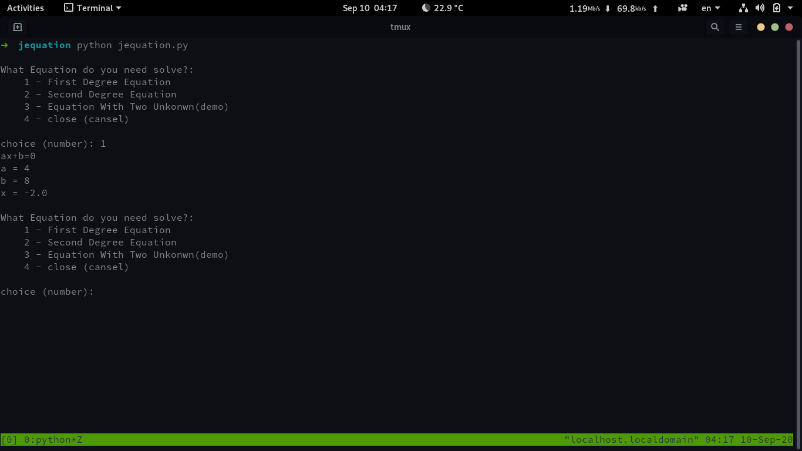
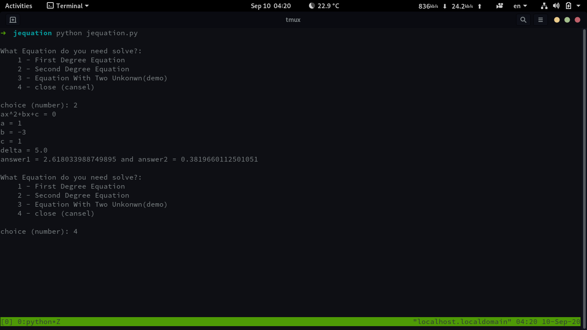
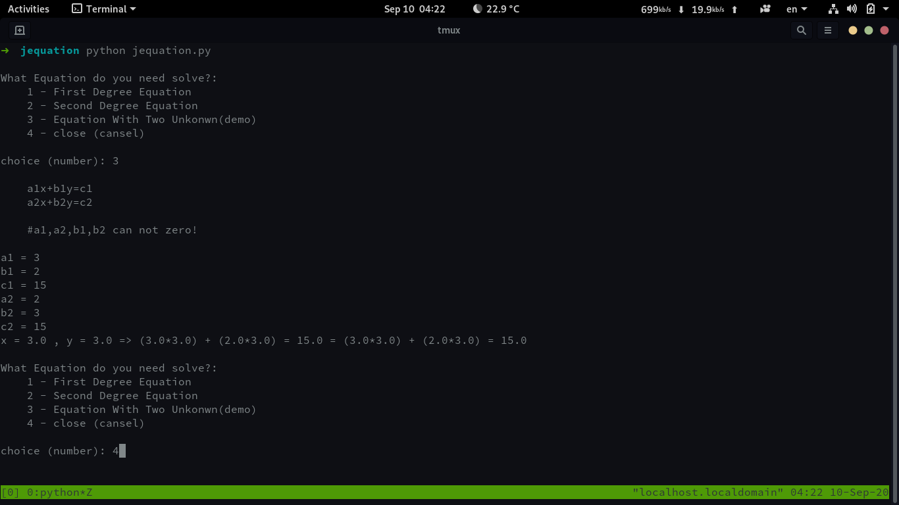

#jequation

##this is a project that can solve the equation

##This is not a complete project and I would be happy if you criticize.
##I made this project in honor of my dear master Jadi.
##https://github.com/jadijadi

